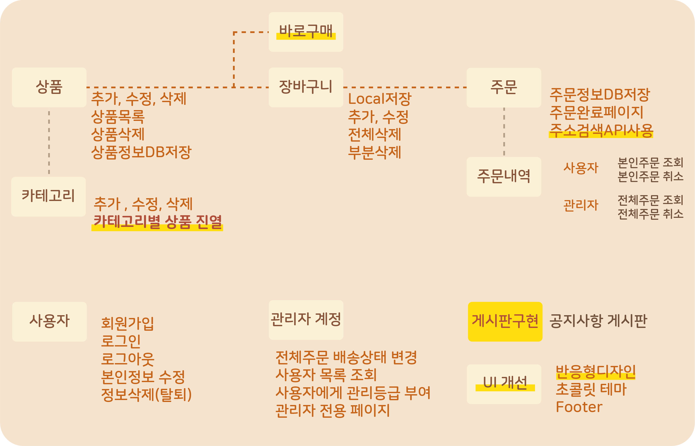

# 이상한 나라의 초콜릿 프로젝트

초콜릿제품을 전문적으로 판매하는 쇼핑몰을 구현였습니다. 2022.5.30 ~ 2022.6.10<br />

#### 🔗 http://kdt-sw2-busan-team02.elicecoding.com/

## 🍫structure chart


<br />

## 🙋‍♀️ 담당 부분
1. 상품 상세 페이지
2. 장바구니 페이지
- localStorage를 활용하여 전체선택, 선택삭제, 수량 증감 기능 구현
3. 관리자 모드의 상품 및 카테고리 추가 ・ 수정 ・ 삭제 기능 구현

## 🍪 Tech stacks & Tools

<ul style="display:flex;">
  <li style="list-style:none; margin-right:5px;"></li>
  <li style="list-style:none; margin-right:5px;"></li>
  <li style="list-style:none; margin-right:5px;"></li>
</ul>
<ul style="display: flex;">
  <li style="list-style:none; margin-right:5px;"></li>
  <li style="list-style:none; margin-right:5px;"></li>
  <li style="list-style:none; margin-right:5px;"></li>
</ul>
<ul style="display:flex;">
  <li style="list-style:none; margin-right:5px;"></li>
  <li style="list-style:none; margin-right:5px;"></li>
  <li style="list-style:none; margin-right:5px;"></li>
  <li style="list-style:none; margin-right:5px;"></li>
  <li style="list-style:none; margin-right:5px;"></li>
  <li style="list-style:none; margin-right:5px;"></li>
</ul>

## 🍰Developers

박소정 , 백광천 , 반유진 , 이수정 , 주현정

---

## 폴더 구조

- 프론트: `src/views` 폴더
- 백: src/views 이외 폴더 전체
- 실행: **프론트, 백 동시에, express로 실행**

## 설치 방법

1. **.env 파일 설정 (MONGODB_URL 환경변수를, 개인 로컬 혹은 Atlas 서버 URL로 설정해야 함)**

2. express 실행

```bash
# npm 을 쓰는 경우
npm install
npm run start

# yarn 을 쓰는 경우
yarn
yarn start
```

3. 회원가입 후 MONGODB에서 user의 role을 "admin"으로 변경 후, 관리자 모드로 상품 등록 후 쇼핑몰 사용 가능

---

본 프로젝트에서 제공하는 모든 코드 등의는 저작권법에 의해 보호받는 ㈜엘리스의 자산이며, 무단 사용 및 도용, 복제 및 배포를 금합니다.
Copyright 2022 엘리스 Inc. All rights reserved.
